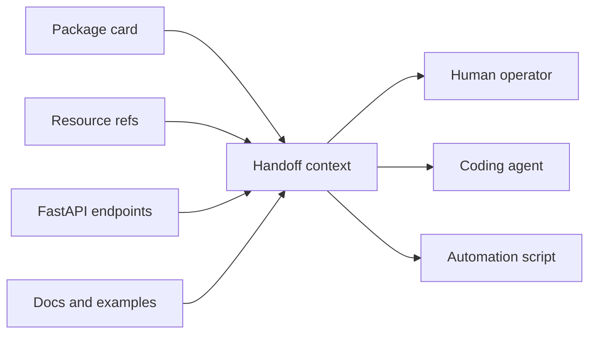

# Launch Boundary

AAAX is the boundary between package metadata and a usable application surface.
It prepares the environment a caller needs, but it does not try to become the
caller.

## What Launch Means Here

In the current surface, launch means:

- Load a strategy file or package manifest.
- Resolve the resources that belong to the application.
- Bind local handlers where the package provides local Python entrypoints.
- Prepare channel storage for package channels.
- Expose a FastAPI app with stable endpoints.

The agent-facing layer can build on this later by reading the same resource map,
package cards, docs, examples, and service URLs.

## What AAAX Avoids

AAAX does not own:

- model provider configuration;
- prompt execution;
- tool permission policy;
- distributed scheduling;
- production deployment;
- package storage;
- long-term event retention.

Those jobs belong to LLLM runtimes, SSSN stores, PsiHub, deployment platforms,
and agent tools. AAAX keeps the composition boundary boring enough that all of
those systems can meet there.

## Handoff Shape

The handoff is intentionally data-shaped: names, refs, docs, endpoints, and
examples. That keeps AAAX compatible with many agent and IDE surfaces.
