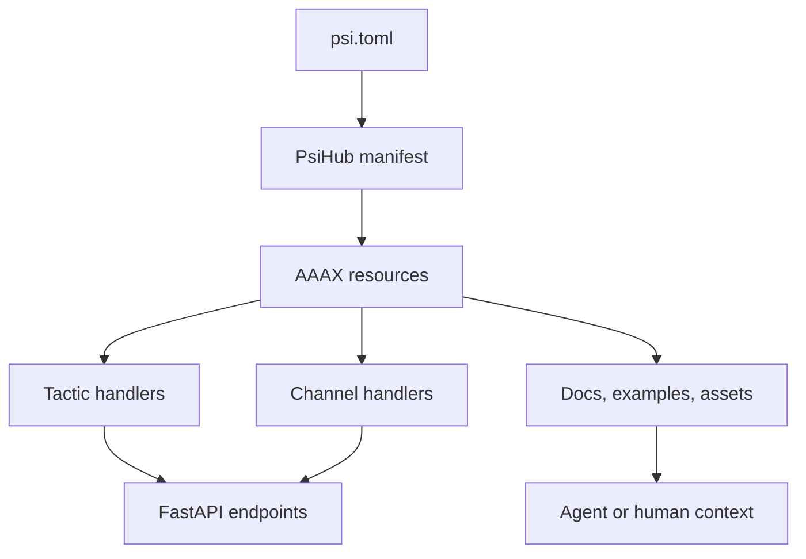

# Package Composition

AAAX composes packages by importing manifest resources into a strategy. A package
remains the unit of publication and discovery. A strategy is the unit of launch.



## Direct Package Strategy

`strategy_from_package(path)` creates one strategy from one package:

```python
from aaax import strategy_from_package


strategy = strategy_from_package("packages/analyst-pack")
```

The strategy name defaults to `package.name`. Package card metadata is copied
onto the strategy and package resource.

## Imported Packages

`Strategy.use_package(path)` adds one package to an existing strategy:

```python
from aaax import Strategy


strategy = Strategy("workbench")
strategy.use_package("packages/sources", prefix="sources")
strategy.use_package("packages/analysts", prefix="analysts")
```

Prefixes only affect local strategy names. The original `psi://` refs stay in
the resource records.

## Binding

When `bind=True`, AAAX tries to bind:

- Python tactic entrypoints through LLLM's `Tactic` or `as_tactic` boundary.
- Package channels to a local SSSN `LocalStore`.
- Services that declare one `tactic` to the same tactic handler.

Use `bind=False` when you only want the resource graph and metadata:

```python
strategy.use_package("packages/remote-only", bind=False)
```

That is useful for remote packages, planning tools, and agent handoff contexts
where another process will resolve the actual service URLs.
