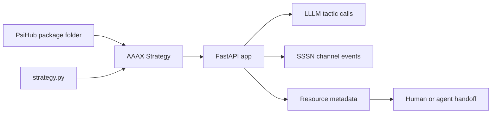

# AAAX

<p class="psi-brand">
  
  
</p>

[aaax.one](https://aaax.one){ .psi-domain }

AAAX is the PSI strategy and launch boundary. It turns a set of PsiHub package
resources into one service-facing application surface: tactics become callable,
channels become append/query endpoints, package cards become useful context,
and a strategy file can compose several packages into one workbench.

AAAX is deliberately small. It does not replace LLLM, SSSN, PsiHub, model
runtimes, coding agents, schedulers, or deployment systems. It owns the layer
where packages are selected, named, served, and prepared for a human or agent
workflow.

<div class="psi-tiles">
  <div class="psi-tile">
    <strong>Strategy</strong>
    One application boundary that names tactics, channels, services, package refs,
    docs, examples, assets, and optional run behavior.
  </div>
  <div class="psi-tile">
    <strong>Package</strong>
    A `psi.toml` manifest can be served directly or imported into a larger strategy.
  </div>
  <div class="psi-tile">
    <strong>Service</strong>
    FastAPI exposes stable endpoints for strategy runs, tactic calls, resource
    invocation, and channel events.
  </div>
  <div class="psi-tile">
    <strong>Launch</strong>
    AAAX prepares the resource map and service surface that a future agent or
    human-facing launcher can use.
  </div>
</div>

## Fast Path

Serve any folder that contains a PsiHub package manifest:

```bash
aaax serve packages/analyst-pack --port 8400
```

Call a package tactic:

```bash
curl -X POST http://127.0.0.1:8400/tactics/echo/run \
  -H 'content-type: application/json' \
  -d '{"input": {"text": "hello"}, "context": {"request": "demo"}}'
```

Append and query SSSN-backed channel events:

```bash
curl -X POST http://127.0.0.1:8400/channels/events/events \
  -H 'content-type: application/json' \
  -d '{"input": {"kind": "record", "payload": {"text": "hello"}}}'

curl 'http://127.0.0.1:8400/channels/events/events?limit=10'
```

## Shape



The important part is that packages remain package-shaped. AAAX does not nest
runtimes inside runtimes; it imports resources by stable names, keeps their
`psi://` refs, binds the local handlers it can safely bind, and exposes a single
boundary that other tools can call.

## What AAAX Owns

- `Strategy`, `StrategyResource`, and the application-level resource registry.
- Loading `strategy.py`, `aaax.py`, `module:factory`, package folders, and
  direct `psi.toml` files.
- Importing PsiHub package resources into a strategy.
- Binding Python tactic entrypoints through LLLM when available.
- Creating local SSSN stores for package channels.
- Serving the strategy through FastAPI and the `aaax` CLI.

## What Stays Outside

- LLM provider execution, tool policy, traces, evals, and runtime internals.
- Package indexing, package upload/download, validation reports, and hub storage.
- Durable production storage, deployment, queueing, and service orchestration.
- Coding-agent behavior itself. AAAX prepares the context and service surface
  that an agent can use.

## Next

- Start with [Getting Started](getting-started.md).
- Learn the model in [Strategies](concepts/strategies.md).
- See how packages are imported in [PsiHub Packages](composition/psihub-packages.md).
- Serve your first package in [Serve A Package](tutorials/serve-package.md).
