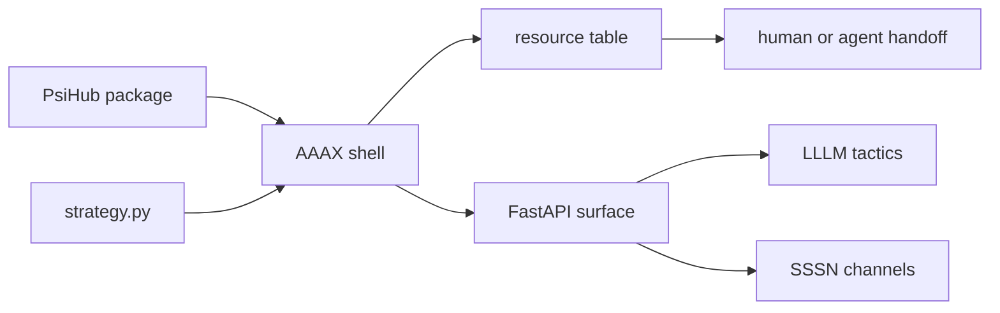

# AAAX

<p class="psi-brand">
  
  
</p>

[aaax.one](https://aaax.one){ .psi-domain }

AAAX is the PSI shell for package-shaped agent systems. It gives packages a
place to become useful: inspect a manifest, mount its tactics and channels, bind
local handlers, open a FastAPI surface, and hand the resulting environment to a
human, script, or coding agent.

<div class="aaax-shell" aria-label="AAAX shell transcript">
  <span><span class="aaax-shell__prompt">$</span> aaax inspect packages/analyst-pack</span>
  <span><span class="aaax-shell__ok">mounted</span> tactic echo -> psi://demo/analyst-pack/tactics/echo</span>
  <span><span class="aaax-shell__ok">mounted</span> channel events -> psi://demo/analyst-pack/channels/events</span>
  <span><span class="aaax-shell__prompt">$</span> aaax serve packages/analyst-pack --port 8400</span>
  <span><span class="aaax-shell__muted">listening</span> http://127.0.0.1:8400</span>
</div>

AAAX stays thin on purpose. LLLM owns tactic execution, SSSN owns semantic
channels, PsiHub owns package protocol and storage, and agent tools own their
reasoning loops. AAAX is the shell where those resources get named, mounted,
served, and passed along.

<div class="psi-tiles">
  <div class="psi-tile">
    <strong>Inspect</strong>
    Read a package or strategy and see the local command surface before serving it.
  </div>
  <div class="psi-tile">
    <strong>Mount</strong>
    Mount `psi.toml` resources into one shell without erasing their `psi://` refs.
  </div>
  <div class="psi-tile">
    <strong>Pipe</strong>
    Call tactics, append/query channels, and invoke resources through stable endpoints.
  </div>
  <div class="psi-tile">
    <strong>Handoff</strong>
    Preserve cards, docs, examples, assets, and service URLs for people and agents.
  </div>
</div>

## Fast Path

Serve a package:

```bash
aaax serve packages/analyst-pack --port 8400
```

Call a tactic:

```bash
curl -X POST http://127.0.0.1:8400/tactics/echo/run \
  -H 'content-type: application/json' \
  -d '{"input": {"text": "hello"}, "context": {"request": "demo"}}'
```

Write and read a channel:

```bash
curl -X POST http://127.0.0.1:8400/channels/events/events \
  -H 'content-type: application/json' \
  -d '{"input": {"kind": "record", "payload": {"text": "hello"}}}'

curl 'http://127.0.0.1:8400/channels/events/events?limit=10'
```

## Shape



AAAX treats a package like something you mount into a shell session. The local
name can change, but the package ref remains stable. A caller can list what is
mounted, run one tactic, append an event, invoke a service, or call the shell's
top-level `/run` command.

## What AAAX Owns

- `Strategy`, `StrategyResource`, and the shell's mounted resource table.
- Loading `strategy.py`, `aaax.py`, `module:factory`, package folders, and
  direct `psi.toml` files.
- Mounting PsiHub package resources into one local namespace.
- Binding Python tactic entrypoints through LLLM when available.
- Opening SSSN-backed local channel endpoints.
- Serving the shell through FastAPI and the `aaax` CLI.

## What Stays Outside

- LLM provider execution, tool policy, traces, evals, and runtime internals.
- Package indexing, package upload/download, validation reports, and hub storage.
- Durable production storage, deployment, queueing, and service orchestration.
- Coding-agent behavior itself. AAAX gives agents a shell surface; it does not
  decide how they reason.

## Next

- Start with [Getting Started](getting-started.md).
- Learn the model in [Strategies](concepts/strategies.md).
- Mount packages in [PsiHub Packages](composition/psihub-packages.md).
- Serve your first package in [Serve A Package](tutorials/serve-package.md).
