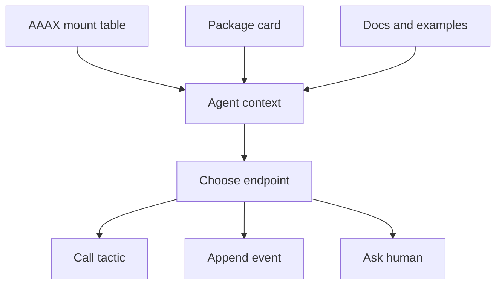

# Agentic Shell

AAAX is not an agent runtime, but it is designed so an agent can receive useful
shell context without guessing.

## What An Agent Can Read

An agent or IDE surface can call:

```text
GET /strategy
GET /resources
GET /packages
GET /tactics
GET /channels
```

From those endpoints it can learn:

- which packages are present;
- which tactics are callable;
- which channels accept events;
- which services are mapped to tactics;
- where docs, examples, and assets live;
- what package cards suggest about safety, latency, and commands.

## What An Agent Can Do

The same shell surface lets an agent:

- call one tactic with `/tactics/{name}/run`;
- invoke a named service through `/resources/{name}/invoke`;
- append an observation to a channel;
- query channel history;
- call `/run` for the strategy's intended top-level operation.

## Handoff Contract



The handoff contract is metadata plus endpoints. AAAX avoids telling the agent
how to reason, but gives it a shell-shaped surface it can inspect before acting.
