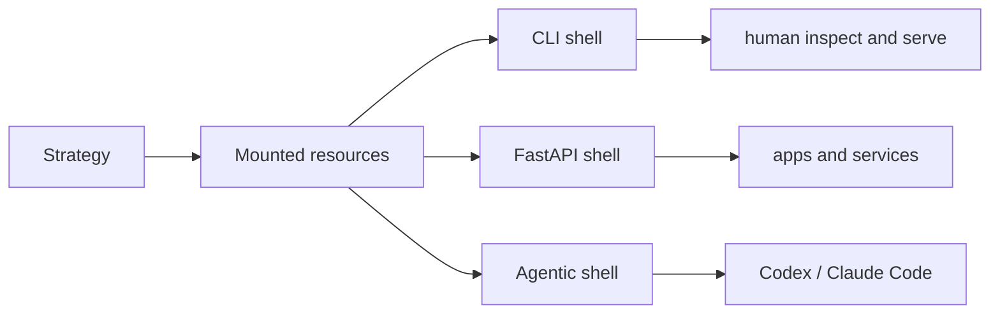

# Shell

Shell is the callable half of AAAX. After a package or strategy is loaded and
resources are mounted, AAAX exposes the same strategy through surfaces for
humans, applications, and coding agents.

## Shell Surfaces

- [CLI Shell](cli-shell.md): a human-facing command surface for inspecting,
  mounting, and serving packages.
- [FastAPI Shell](fastapi-surface.md): an application-facing HTTP surface for
  `/run`, tactics, channels, packages, and resource invocation.
- [Agentic Shell](agent-handoff.md): an agent-facing context surface for Codex,
  Claude Code, IDE agents, and other coding-agent workflows.

## Operational Boundary

AAAX validates host, port, and log-level CLI inputs. It does not manage TLS,
replicas, queue workers, secrets, containers, or cloud deployment. Keep those in
the deployment layer and treat AAAX as the shell object that layer serves.
