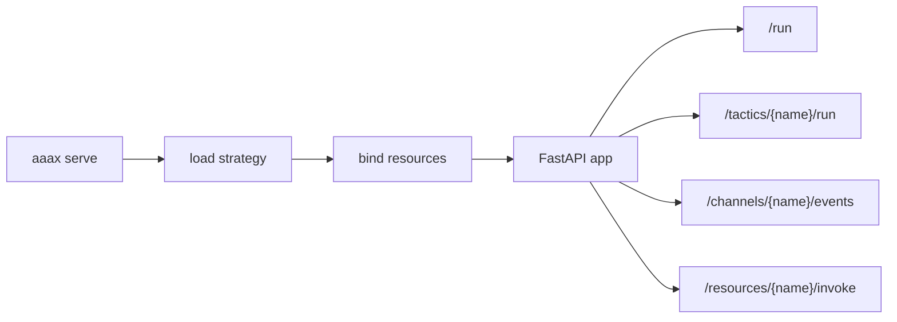

# Launch

Launch is the service-facing half of AAAX. After a strategy is loaded and
resources are bound, AAAX exposes a FastAPI app that can be called by scripts,
humans, local tools, and future agent workflows.



## CLI Launch

```bash
aaax serve strategy.py --host 127.0.0.1 --port 8400
aaax serve packages/analyst-pack --port 8400
```

`launch` is currently an alias for `serve`:

```bash
aaax launch packages/analyst-pack --port 8400
```

## In-Process Launch

```python
from aaax import create_strategy_app, load_strategy


strategy = load_strategy("packages/analyst-pack")
app = create_strategy_app(strategy)
```

Then run it with Uvicorn, Hypercorn, or your deployment server.

## Operational Boundary

AAAX validates host, port, and log-level CLI inputs. It does not manage TLS,
replicas, queue workers, secrets, containers, or cloud deployment. Keep those in
the deployment layer and treat AAAX as the application object that layer serves.
